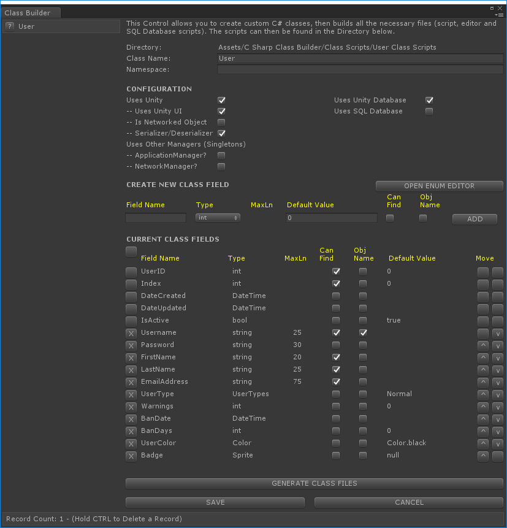

# Unity-C-Sharp-Class-Builder

A Unity C# tool that lets the user create custom C# classes (field types: bool, int, float, vector2, vector3, quaternion, string, datetime, enum, sprite/image), and generates all the code for the class (private variables, private internal properties, public properties, private functions, private events and public functions).

The tool can also create all the SQL statements to generate tables and stored procedures used by the class for use with Microsoft SQL Server.

Settings can also generate a Unity Asset Database, so the user can create their own database without the use of SQL.

Also included in the package is a DatabaseManager and DAL suite that allows the developer to connect to and interact with Microsoft SQL Server, MySQL and SQLite databases/servers.

Run as a tool from the main menu bar.

